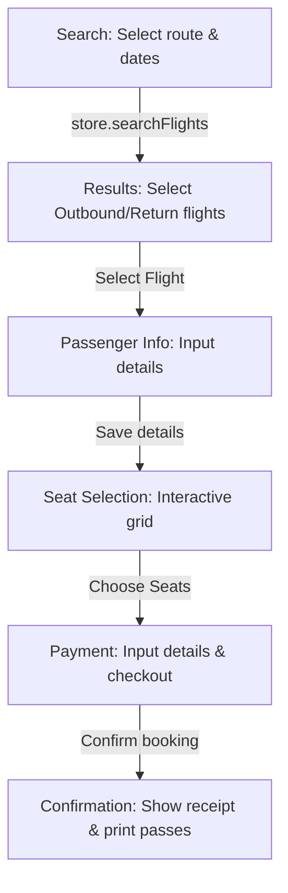

# System Architecture: Capstone Flight Booking System

This document describes the directory structure, routing, components, store layout, and data flow of the Capstone Flight Booking application.

---

## 1. Directory Structure

Inside `capstone-app/src/`:
```text
src/
├── assets/          # Static images, SVGs, logos
├── components/      # Reusable UI elements
│   ├── Navbar.jsx
│   ├── Footer.jsx
│   ├── FlightCard.jsx
│   ├── SeatMap.jsx
│   └── AirportAutocomplete.jsx
├── services/        # Logic APIs / deterministic mock services
│   └── flightService.js
├── store/           # Zustand global state management
│   └── useBookingStore.js
├── pages/           # Page views corresponding to routes
│   ├── SearchPage.jsx
│   ├── ResultsPage.jsx
│   ├── PassengerPage.jsx
│   ├── SeatSelectionPage.jsx
│   ├── PaymentPage.jsx
│   └── ConfirmationPage.jsx
├── App.jsx          # Main Router Setup
├── App.css          # Custom overrides / print media styling
├── index.css        # Tailwind directives and design system variables
└── main.jsx         # App mounting point
```

---

## 2. Zustand Store Design (`useBookingStore.js`)

The global state will manage:
- **Search Parameters**:
  - `searchParams`: `{ from, to, departDate, returnDate, passengers: { adults, children } }`
- **Flight Options & Selections**:
  - `flightsOutbound`: list of available outbound flights
  - `flightsReturn`: list of available return flights
  - `selectedOutbound`: selected outbound flight object
  - `selectedReturn`: selected return flight object (or null for one-way)
- **Booking Sequence Data**:
  - `passengers`: array of passenger objects `[{ firstName, lastName, email, phone }]`
  - `selectedSeats`: `{ outbound: [], return: [] }`
  - `payment`: `{ cardholderName, cardNumber, expiryDate, cvv }`
- **Checkout Metadata**:
  - `bookingReference`: unique 6-character receipt string
  - `bookingConfirmed`: boolean flag

---

## 3. Data Flow and Routes



---

## 4. Visual Styling & Design System
- **Theme**: Premium dark mode base with harmony colors (indigo/violet gradients, emerald accent colors for selections, rose for unavailable seats).
- **Glassmorphism**: Elegant transparent cards with subtle white borders (`backdrop-blur-md bg-white/10 border border-white/20`).
- **Interactive States**: Smooth hover transitions, scaling transitions on CTA buttons, and state indicators.
- **Print media optimization**: `@media print` styles to hide navigation bars and fit boarding passes to single-page layouts.
